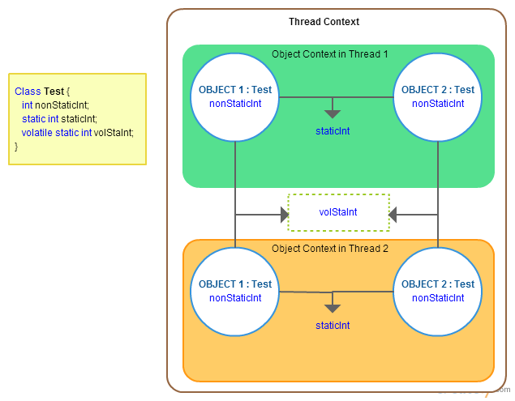

## Volatile Vs Static in JAVA

[http://malalanayake.wordpress.com/2013/09/12/volatile-vs-static-in-java/](http://malalanayake.wordpress.com/2013/09/12/volatile-vs-static-in-java/)

volatile能保证原子性和可见性.对static field的内存模型认识不足导致有些概念模糊了.内存结构见图:

<!--more-->

## 101 个 MySQL 的调优贴士

[http://www.oschina.net/translate/101-tips-to-mysql-tuning-and-optimization?print](http://www.oschina.net/translate/101-tips-to-mysql-tuning-and-optimization?print)

看数据库相关的文章看到"双缓存""问题.数据库服务把OS cache打开会导致无意义的"预读取"(操作系统层面的随机或者顺序读取文件)和"后写入"(批处理),而且会导致"双缓冲"和昂贵的内存拷贝."双缓冲"浪费了系统内存,并且浪费了额外的资源处理时间(读:从磁盘到os cache到DBMS cache;写:从DBMS cache 到OS cache 到磁盘).

搜索双缓存相关的东东,把这篇文章搜索出来了.有几点可以说说(数据库管理层面的I DONT CARE!).

	74.为了 避免在更新前SELECT，使用INSERT ON DUPLICATE KEY或者INSERT IGNORE ,不要用UPDATE去实现。 (这深有体会,以前处于二逼阶段写的存储过程由17行变成了7行,简单依赖啊,减少了查询,减少了并发时的异常处理)
	81.使用DROP TABLE，CREATE TABLE DELETE FROM从表中删除所有数据。 (为毛不用truncate?)
	95. 为了更快的进行导入，在导入时临时禁用外键约束。
	96. 为了更快的进行导入，在导入时临时禁用唯一性检测。

## zookeeper 分布式锁的实现

[http://bohr.me/zookeeper-dev-ops/](http://bohr.me/zookeeper-dev-ops/)

给自己写的zookeeper相关的分析添加一个链接地址.

## Spring Data Repositories - A Deep Dive

[https://github.com/olivergierke/repositories-deepdive](https://github.com/olivergierke/repositories-deepdive)

[http://spring.io/blog/2011/04/26/advanced-spring-data-jpa-specifications-and-querydsl/](http://spring.io/blog/2011/04/26/advanced-spring-data-jpa-specifications-and-querydsl/)

最近在看jpa,spring对jpa的支持确实比较犀利.Querydsl结合APT可以写出类型安全,易读的查询语句.不知道性能如何?

	@Test
	public void testQuerydsl() throws Exception {
		QTask $ = QTask.task;
		BooleanExpression titleStartWith = $.title.startsWith("Study");
		BooleanExpression descEndWith = $.description.endsWith("org/");

		Iterable<Task> result = taskDao.findAll(titleStartWith.and(descEndWith));
		for (Task task : result) {
			System.out.println(task);
		}
	}
上面这段代码最后生成的sql如下:

	select
        id,raw_add_time,raw_update_time,description,title,user_id
    from
        t_task  
    where
        (title like ? escape '!')
        and (description like ? escape '!')

## ROCA Resource-oriented Client Architecture

A collection of simple recommendations for decent Web application frontends.
可以参考下,

## 加盐密码哈希：如何正确使用

[http://blog.jobbole.com/61872/](http://blog.jobbole.com/61872/)

The Enemy Knows The System.看了这篇文章,感觉我们做的东西太少了,对于密码的重视程度还不够,简单总结下:

1. 永远不要告诉用户到底是用户名错了，还是密码错了
2. 不要使用短盐值和盐值重复(明白了某开源项目为什么用户表里有个salt字段)
3. 盐值应该使用基于加密的伪随机数生成器来生成,java里面用`java.security.SecureRandom`
4. 使用慢哈希函数,java里面用`PBKDF2WithHmacSHA1`(需要权衡,太慢了会把登录做成DDOS攻击)
5. 不要使用过时的hash算法,比如MD5或SHA1
6. 密码重置时令牌应该要有有效期,并且重置时需要生成新的盐值.
7. 不要过于频繁地强制你的用户修改密码，最多6个月1次(呵呵,bops)

这些用上基本上就够了.附带赠送一个能够破解任何8位及以下长度MD5值的[彩虹表](https://www.freerainbowtables.com/en/tables2/)

## Java中的CopyOnWrite容器

[http://coolshell.cn/articles/11175.html](http://coolshell.cn/articles/11175.html)

以前只是把CopyOnWrite用于拦截器这些场景,看来用于黑/白名单也挺适合的.特别是`CopyOnWriteMap`,很适合读写比例很大的场景.

不过原文中提到的`内存占用问题`,我不赞同此问题,map本身的数据结构是Entry,这个Entry会上百M?`Arrays.copyOf`和`java.util.HashMap#HashMap(java.util.Map<? extends K,? extends V>)`都不是深拷贝.

## 5 Techniques to Improve Your Server Logging

[http://www.takipiblog.com/2014/02/27/5-techniques-to-improve-your-server-logging/](http://www.takipiblog.com/2014/02/27/5-techniques-to-improve-your-server-logging/)

文章提到5个处理服务器端日志的细节.值得分享下:

1. Hello my (Thread) name is

   给线程取一个合理的名字.在开发云消息中间件时,考虑到便于跟踪业务执行轨迹,统一用msgid来作为线程的名字.

   现在想起来还是比较土,当时不知道有[MDC](http://logback.qos.ch/manual/mdc.html)这个概念(2012年看到这个概念还很[兴奋](http://www.weibo.com/1880205234/yyHbX4elU?mod=weibotime)).现在我写的系统中,基本上都引入了MDC这个东东,方便自己定位问题.

2. Distributed identifiers

	每个业务请求需要一个唯一的业务标识.这个必须有,写了`ID`就是来干这事的.我很赞同作者的观点,` every inbound operation going into your system should have a unique ID which will travel with it until it’s completed. `,我们的gid改造还没有结束,哈哈.

3. Dont text + drive. Don’t log + loop

	在循环里面处理日志要小心,作者举的例子是加了一个打印日志次数的限制.在`while`循环里处理东东都要小心,最近给某项目分析定时任务没有执行的问题,发现循环中插入数据库,结果悲剧了,死循环一直插,数据库表示好伤啊.

4. Uncaught handlers

	给线程加上未捕获的异常处理器.

	在和peigen讨论摘要日志时,提到了要加这个东东,结果真的给忘了.哎,真的老了么?忘事太容易了.真得注意下防御性编程了.openapi使用摘要日志api有问题,导致空指针异常,我在代码中加了一行error日志`由于api使用不当导致线程本地变量DL被清空,请仔细检查您的代码.本次操作会重新生成DL对象`.但是还有个洞没有塞住.万一使用`SDL`时,没有在`final block`中调用`SDL.end()`,最终会导致OOM.在`Thread.setDefaultUncaughtExceptionHandler`时,来清除`SDL`,也算是一个不错的方式.

	摘要日志API的设计过程中主要想着能给大家提供方便使用的api.现在易用性已经达到了,但是感觉用得不当太危险了.特别是`SDL`,`ThreadLocal`中有个`ArrayDeque`,万一没有调用`SDL.end()`,迟早会有OOM.

	线程变量真可怕!!!

5. Catch external calls

	外部调用都要catch异常并记录日志.最好也别把异常吞了,重新抛出一个程序内部定义的运行时异常吧.分布式应用外部调用都很多,建议还是统一来处理日志和异常转换,AOP派上用场了.

评论更精彩,有童鞋建议外部调用记录处理时长,用csv来记录日志便于后期处理.摘要日志中有记录时长的,我们用的json来记录日志,更方便处理,只是业务线程需要承担序列化的开销.

## The Logging Olympics – A Race Between Today’s Top 5 Java Logging Frameworks

[http://www.takipiblog.com/2013/12/18/the-logging-olympics-a-race-between-todays-top-5-logging-frameworks/](http://www.takipiblog.com/2013/12/18/the-logging-olympics-a-race-between-todays-top-5-logging-frameworks/)

比较了几种日志框架,以前在写[日志优化](http://bohr.me/2013/07/09/log-tuning.html)时,注意到了log4j2异常牛掰,特别是采用了[disruptor](http://logging.apache.org/log4j/2.x/manual/async.html)的异步日志,在多线程下的表现非常夸张.不过我们已经被绑架到logback了,只是看看而已.

## First-class functions in Java 8

[http://www.youtube.com/watch?v=Rd-sqHjmfB0](http://www.youtube.com/watch?v=Rd-sqHjmfB0)

这动画做的挺有意思,只是Java8还离我们比较远啊.
