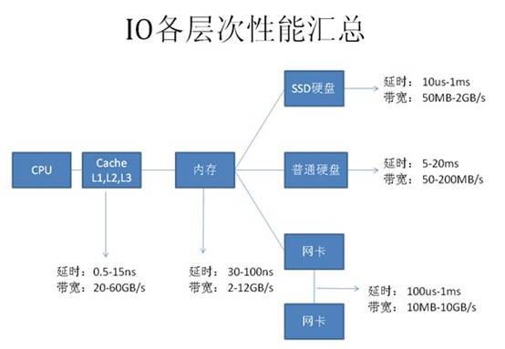

## Linux Troubleshooting, Part I: High Load
http://www.linuxjournal.com/magazine/hack-and-linux-troubleshooting-part-i-high-load

10月25(This is my big day)日凌晨线上某系统出现`load`很高的问题,我当时排查问题的思路和这篇文章类似.简单总结下:

`load`,系统负载,可以理解为现在等待cpu处理的任务数.如何衡量`high`呢?这个和cpu核心数有关系,8核cpu,load为8,这个也不能称之为high.

造成high load的原因一般有:

* CPU-bound load

	某些任务太耗cpu了,导致high load.这个通过看top就能看出来.如果`top`命令中的`xx%wa`很高,说明这些任务都在等待去了.

* load caused by out of memory issues

	由于内存不足,linux在使用swap了,导致high load.这个通过`free`很容易看出来.

* I/O-bound load

	iostat/iotop(需安装)都很容易发现原因所在.

我偏向于使用`vmstat`,用了它,什么都可以看到了.很悲剧的是,这台线上服务器一切正常.服务器重启后,负载一直很低.服务器重启后,一切都正常了.

## The Best Plugins for Sublime Text
http://ipestov.com/the-best-plugins-for-sublime-text/

可以把sublime武装成ide的插件.

## ibatis和mybatis共存
如果先加载ibatis的jar,会遇到`java.lang.reflect.MalformedParameterizedTypeException`异常.需要让ibatis后加载.可以修改`ibatis`依赖的`artifactId`,比如改为`zibatis`

## MySQL 加锁处理分析
http://hedengcheng.com/?p=771

这篇文章从mysql数据库原理角度来分析锁,很透彻,很深刻.

比如对于一条简单的sql语句:

	delete from test where id = ?；

如果id是主键/非空的唯一索引,不会出现gap锁.如果是非索引列,直接锁表(这个太恶心了,因为server和存储引擎分离导致的);如果是非唯一的索引,事务隔离级别是read commit,锁定选取的数据.如果是repeatable read,为了防止幻读,gap lock出现了)

##面向程序员的数据库访问性能优化法则
http://blog.csdn.net/yzsind/article/details/6059209

这篇文章很系统的介绍了程序员应该掌握的数据库优化知识.
首先根据硬件相关知识介绍各种硬件的访问延时/带宽指标:

通过对上面的指标分析,自然得出优化的层次:

1. 减少数据访问（减少磁盘访问）

	* 正确创建/使用索引
	* 只通过索引访问数据(索引节点中存有数据,通过索引就能拿到数据最高效)
	* 根据查询计划优化索引
	* 一个表上的索引不能太多,会增加修改操作IO.

2. 返回更少数据（减少网络传输或磁盘访问）

	* 分页(通过rowid分页的方式减少IO,前提是where/order子句都要在索引上)
	* 只返回需要的字段(别使用select *,带来各种问题,对于我们来说,最头痛的是sql版本兼容性问题.)

3. 减少交互次数（减少网络传输）

	* batch DML(批量操作走jdbc批量接口)
	* In List(多操作合并,依稀记得mysql驱动里也有这样的做法)
	* 设置Fetch Size(默认fetch size可能不是最优的,需要根据实际情况调整,比如分页查询,一次查询100条,在不OOM的前提下增大此值,减少网络io)
	* 使用存储过程(这个得看场景)
	* 使用ResultSet游标处理记录(这一点往往被忽略掉,使用mybatis的RowHandler来解决问题)

4. 减少服务器CPU开销（减少CPU及内存开销）

	* 使用绑定变量(mysql仅仅支持硬解析,[参考](http://www.cnblogs.com/justfortaste/p/3920140.html))
	* 合理使用排序

5. 利用更多资源（增加资源）
