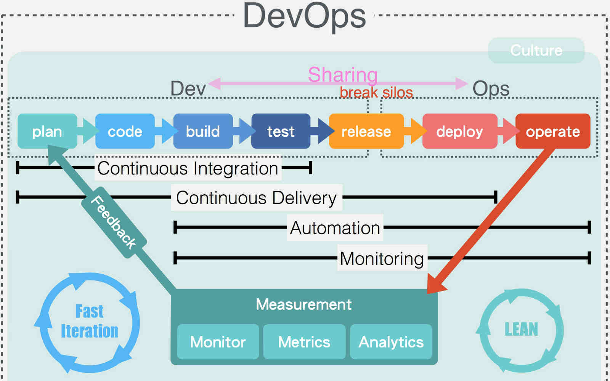

## <a name="about-arch">[每个架构师都应该研究下康威定律](http://mp.weixin.qq.com/s?__biz=MzA5Nzc4OTA1Mw==&mid=408286995&idx=1&sn=1634698023c48b754d42af69cee2ab32)</a>

最近在做`DEVOPS`,看技术的出发点有所变化，正好看到这篇文章，总结下自己。

### 1. 系统架构的目标是解决利益相关者的关注点。

>>架构其实是发现利益相关者（stakeholder），然后解决他们的关注点（concerns）
>>
>> 业务方，产品经理，客户/用户，开发经理，工程师，项目经理，测试人员，运维人员，产品运营人员等等都有可能是利益相关者，架构师要充分和利益相关者沟通，深入理解他们的关注点和痛点，并出架构解决这些关注点。

架构师在这里也定位为一个好的需求分析师，但是架构师往往会从自己的角度(利益相关或者立场相关)来设计。我之前一直做开发工作，在技术选型或者研究时，对于可运维性考虑得比较少，在痛过几次后，发现监控的价值，来补充相关`metrics`的能力。

### 2. 关注非功能性需求

* easy to separate
* easy to understand
* easy to extend
* easy to change
* easy to replace
* easy to deploy
* easy to scale
* easy to recover
* easy to connect
* easy to afford

>> Architecture represents the significant design decisions that shape a system, where significant is measured by cost of change.
>>
>> 架构的目标是用于管理复杂性、易变性和不确定性，以确保在长期的系统演化过程中，一部分架构的变化不会对架构的其它部分产生不必要的负面影响。

这里补充一点，需要考虑`easy to find the problem`。除了合理的规划日志，我们要做到`failfast`。当关键资源依赖条件不满足，我们最好是把问题用最显示的方式暴露出来，而不是让它在那里一直报错。

### 3. 架构的迭代和演化性

>> 做技术架构的都有点完美主义倾向，一开始往往喜欢求大求全，忽视架构的演化和迭代性，这种倾向易造产品和用户之间不能形成有效快速的反馈，产品不满足最终用户需求.
>>
>> 在系统真正地投入生产使用之前，再好的架构都只是假设，产品越晚被使用者使用，失败的成本和风险就越高，而小步行进，通过MVP快速实验，获取客户反馈，迭代演化产品，能有效地减少失败的成本和风险。

好的架构是衍变出来的，而非设计出来的。

### 4. 构建闭环反馈架构

>>第一条道路，系统思维，开发驱动的组织机体，其能力不是制作软件，而是持续的交付客户价值，架构师需要有全局视角和系统思维（System Thinking），深入理解整个价值交付链，从业务需求、研发、测试、集成，到部署运维，这条价值链的效率并不依赖于单个或者几个环节，局部优化的结果往往是全局受损，架构师要站在系统高度去优化整个价值交付链，让企业和客户之间形成快速和高效的价值传递。

>>第二条道路，强化反馈环，任何过程改进的目标都是加强和缩短反馈环。
>>
>>收集->测量->调整->闭环重复，在有测量数据和反馈的基础上，系统、应用、流程和客户体验才有可能获得持续的提升和改善，否则没有数据的所谓改进只能靠拍脑袋或者说猜测。

这里提到监控的重要性，**没有测量，就没有改进和提升**，[MDD](http://www.infoq.com/cn/articles/metrics-driven-development)这偏文章有点意思，通过分层和可用的性能指标让开发人员了解项目业务方面的内容，反过来，业务人员也能理解项目技术方面的内容，看到开发人员所面临的问题和我们的负载局限。

>>第三条道路，鼓励勇于承担责任，冒险试错和持续提升的文化。

最后，贴上一张关于`DevOps`的图。

## 时间序列数据库的秘密

[http://www.infoq.com/cn/articles/database-timestamp-01](http://www.infoq.com/cn/articles/database-timestamp-01)

[http://www.infoq.com/cn/articles/database-timestamp-01](http://www.infoq.com/cn/articles/database-timestamp-01)

[http://www.infoq.com/cn/articles/database-timestamp-01](http://www.infoq.com/cn/articles/database-timestamp-01)

此文讲明白了时序数据库，最近也在纠结这个事(原来一直看好opentsdb，但是没有深入调研opentsdb的细节，对es也不是太了解)，这里总结下全文。

时间序列数据库除了提供查询能力外，我们也希望能够提供在查询阶段做聚合能力。

聚合有有三个步骤:

* 用索引检索出行号(搜索引擎最擅长)
* 从主存储按行号加载列(列式存储最合适)
* 计算(分布式计算列数据)

`ES`在这三个步骤上都做得很好。

1. 如何快速检索？

	
	
	lucene倒排索引由`Term index`->`Term Dictionary`->`Posting List`构成。`TI`是对`TD`做的索引，实现对Term的快速查找。Mysql使用b-tree排序存储`TD`在磁盘上;`Lucene`增加了`TI`保存在内存中，查询效率更高。

2. 如何联合索引查询？

	对于`age=18 AND gender=女`的查询过滤。mysql的做法是(如果两个列都建立了索引，当然gender列做索引在mysql上没有什么卵用)先在索引上找`age=18`的所有id，然后遍历id匹配。

	Elasticsearch支持：

	* 使用skip list数据结构。同时遍历gender和age的posting list，互相skip；

		利用skip list(Level0存储原始有序数据，level1存储部分数据，查找时从level1跳过部分数据)，跳过了遍历的成本,并且用`Frame of Reference`(计算差值，分块后，每个块内部选择合适的bit来存储)压缩存储。

	* 使用bitset数据结构，对gender和age两个filter分别求出bitset，对两个bitset做AN操作。

		大多数场景下，bitset非常稀疏，bitset压缩空间很大。lucene采用`Roaring Bitmap`,算法也有点意思：
		计算N/65536和N%65536的值，把N/65536相同的分为一个组，分组后根据每个组的情况用short数字或者bitset。

3. 如何减少文档数？

	一般采用数据库会合并，把多行数据合并成一行，比如把原来精确到秒的数据合并为分。`ES`中使用内嵌文档(Nested Document)实现公共字段的去从(比如应用名、ip、环境标识、metricsname)

4. 如何加载更快？

	如何利用索引和主存储，是一种两难的选择。

   * 选择不使用索引，只使用主存储：除非查询的字段就是主存储的排序字段，否则就需要顺序扫描整个主存储。

		这要求数据存储按照查询条件来选择主键(mysql中的聚簇索引)，如果查询条件很多，会扫描整个文件。

   * 选择使用索引，然后用找到的row id去主存储加载数据：这样会导致很多碎片化的随机读操作。

   	从硬盘上随机读写性能低

   Lucene底层读取文件基于mmap，充分利用操作系统的特性来映射文件到内存(列式存储的优点是每列一个文件，可以充分利用mmap，加载需要的列)，所以还是内存越大越好。

5. 分布式聚合如何做得快？

	通过数据分片，把数据分散到多台机器。在计算时，各个节点index计算聚合结果，然后汇总后在聚合。这样也减少了网络带宽，充分利用了各个节点的计算能力。

6. 为什么时间序列需要更复杂的聚合？

	通常会有降频(比如原来时间精确到秒，现在需要以分为单位)和降维(比如原来有地域纬度，统计时求所有地区)需求。`ES`支持Pipeline Aggregation可以实现数据在聚合之后再做聚合，能满足多次聚合的需求。
