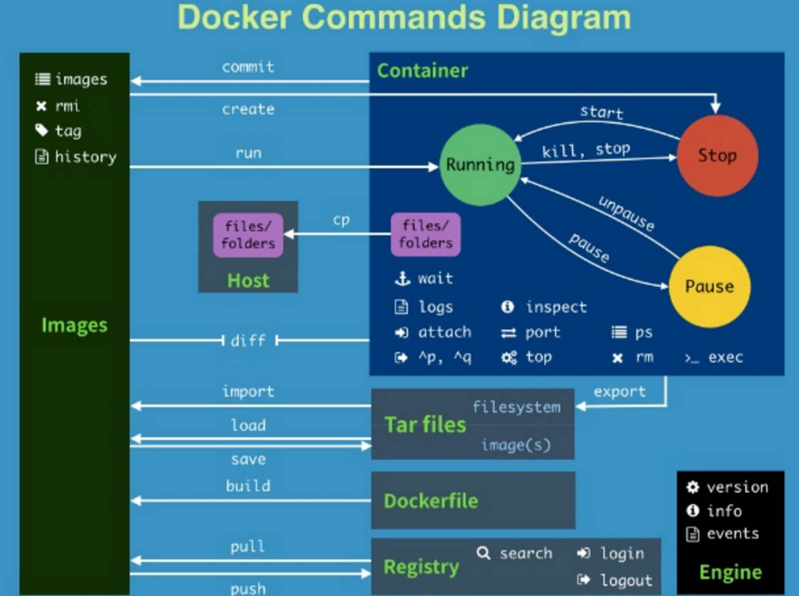

### 1. docker配置

在mac osx中，docker deamon运行在virtualbox虚拟机中，docker client和虚拟机中的docker deamon交互。

#### 1.1 环境配置

	#配置docker环境变量
	eval "$(docker-machine env default)"
	#配置docker启动alias	
	alias docker-start='docker-machine start default'
	#配置docker关闭alias
	alias docker-stop="docker-machine stop default"
	
启动命令如下：
	
	docker-start
	docker-stop

#### 1.2 配置镜像私服

测试环境中私服提供服务如下：

	#docker registry ui
	http://192.168.46.21:10005/
	#docker registry restful api
	http://192.168.46.21:5000/v2/_catalog

下面配置docker registry私服为192.168.46.21：

	#登陆到server
	docker-machine ssh default

	#修改/var/lib/boot2docker/profile
	--insecure-registry 192.168.46.21:5000
	--registry-mirror http://192.168.46.21:5000
	
国内docker mirror：

	https://lug.ustc.edu.cn/wiki/mirrors/help/docker
	http://0b929cdf.m.daocloud.io
	
### 2. docker 常用命令

	
	#拉取镜像
	docker pull yiji/java8:1.0
	
	#查看镜像历史,能看到docker镜像层的细节
	docker history  yiji/java8:1.0
	
	#删除镜像
	docker rmi -f yiji/centos7:latest
	
	#删除容器
	docker rm
	
	#执行命令	
	docker run yiji/centos7 /bin/echo 'hello world'
	
	#交互运行：
	docker run -it yiji/centos7 /bin/bash
	
	#查看容器运行状态
	docker ps -a
		
	#查看指定容器状态
	docker inspect f46935242662
	
	#查看端口隐射，通过inspect结果过滤
	docker inspect --format='{{.NetworkSettings.Ports}}' 8f4a179a0647
	
	#查看容器资源占用
	docker stats 92202cc1c3f0
	
	#查看docker deamon运行ip
	echo $DOCKER_HOST
	
	#清理后台停止的容器
	docker rm $( docker ps -a -q)

	#查看镜像的环境变量
	docker run  yiji/java8:2.0  env

	
### 3. F.A.Q

#### 3.1. docker文件系统

docker镜像的文件系统采用多层存储，镜像中全是只读层，便于分发和共享(pull镜像时，会在本地拉已经存在的层)。运行时建立读写层，对于应用来说，需要把文件系统mount到docker中(这样性能最好)，device mapper对性能有影响。

>>Data volumes provide the best and most predictable performance. This is because they bypass the storage driver and do not incur any of the potential overheads introduced by thin provisioning and copy-on-write. For this reason, you may want to place heavy write workloads on data volumes.

#### 3.2. 关于基础镜像

制作基础镜像时权衡镜像大小(虽然可以在主机上缓存基础镜像，也需要考虑首次分发的大小)。我们最开始使用centos7来制作基础镜像，发现镜像300多M，如果在加上java8，基础镜像有600多M了。
	
可以参考[frolvlad/alpine-oraclejdk8](https://hub.docker.com/r/frolvlad/alpine-oraclejdk8/)来制作基础镜像。
	
		REPOSITORY          TAG                 IMAGE ID            CREATED             VIRTUAL SIZE
		yiji/java8          2.0                 1d58b31d19a0        4 days ago          166.5 MB

java8的基础镜像只有不到200m。

#### 3.3. 制作docker镜像并运行

1. 编写Dockerfile
 
		FROM yiji/java8:2.0
		COPY  yiji-boot-test-1.1-SNAPSHOT.jar /opt/yiji-boot-test-1.1-SNAPSHOT.jar
		WORKDIR /opt
		ENTRYPOINT java -agentlib:jdwp=transport=dt_socket,server=y,suspend=n,address=4004 -jar /opt/yiji-boot-test-1.1-SNAPSHOT.jar

2. build   
    
		docker build -t  yiji-boot-test:1.0 .

3. run
    
        docker run -p 8081:8081 -p 4004:4004  yiji-boot-test:1.0

    其中8081是应用web端口，4004端口是远程调试端口
	
4. 在容器内执行命令

	在容器运行起来后，我们需要去容器内check下情况。
	
		docker exec -it 92202cc1c3f0  sh
		
#### 3.4 docker本地存储

docker 容器运行的文件存储在本地。下面来看看这些文件：

查看docker container id

	CONTAINER ID        IMAGE                COMMAND                  CREATED             STATUS                   PORTS                                            NAMES
	8f4a179a0647        yiji-boot-test:1.0   "/bin/sh -c 'java -ag"   2 hours ago         Up 2 hours               0.0.0.0:4004->4004/tcp, 0.0.0.0:8081->8081/tcp   silly_northcutt
	
登陆到虚拟机，在mac和windows下，docker在虚拟机中运行

	docker-machine ssh default
	
切换到docker运行目录

	sudo su -
	cd /var/lib/docker/aufs/mnt/
	

`ls |grep 8f4a179a0647`发现两个目录

	8f4a179a064737658b4055fb785c432c843f473a9d5fc40fba445017bd5b7e2e
	8f4a179a064737658b4055fb785c432c843f473a9d5fc40fba445017bd5b7e2e-init
	
进入到第一个目录的opt子目录下，会找到我们打包的jar文件(chroot的魔力所在)

	root@default:/mnt/sda1/var/lib/docker/aufs/mnt/8f4a179a064737658b4055fb785c432c843f473a9d5fc40fba445017bd5b7e2e/opt# ls -l
	total 67168
	-rw-r--r--    1 root     root      68777433 Dec 28 08:26 yiji-boot-test-1.1-SNAPSHOT.jar
	
#### 3.5 <a name="docker-security">关于docker的安全</a>

<iframe src="//www.slideshare.net/slideshow/embed_code/key/vhMhelcV6Z9rXr" width="595" height="485" frameborder="0" marginwidth="0" marginheight="0" scrolling="no" style="border:1px solid #CCC; border-width:1px; margin-bottom:5px; max-width: 100%;" allowfullscreen> </iframe> 
 <strong> <a href="//www.slideshare.net/jpetazzo/docker-linux-containers-lxc-and-security" title="Docker, Linux Containers (LXC), and security" target="_blank">Docker, Linux Containers (LXC), and security</a> </strong> from <strong><a href="//www.slideshare.net/jpetazzo" target="_blank">Jérôme Petazzoni</a></strong> 

我们需要做两件事情，

1. 不要使用root in docker

	参考[Running app inside Docker as non-root user](http://stackoverflow.com/questions/24308760/running-app-inside-docker-as-non-root-user)
	
2. 经常升级内核

做安全的同学可以看看更多关于docker 安全的文章:

[docker-bench-security](https://github.com/docker/docker-bench-security)

[Security CheatSheet](https://github.com/konstruktoid/Docker/blob/master/Security/CheatSheet.md)

[CIS Docker 1.6 Benchmark](https://benchmarks.cisecurity.org/tools2/docker/CIS_Docker_1.6_Benchmark_v1.0.0.pdf)

最后引用[David Mortman](https://twitter.com/mortman)在2015年[Defcon](https://www.defcon.org/)的一句话：

>> a year ago, [docker and security] was pretty horrible,six months ago it wasn't so bad, and now it's pretty usable.

#### 3.6 docker run vm?

一些观点：

[2016年六大OpenStack & Docker发展趋势预测](http://dockone.io/article/935)

>>由原本的虚拟机管理程序为核心转变为容器加裸机组合模式

[Hypernetes实现多租户CaaS，且无需客户操作系统](http://www.infoq.com/cn/news/2015/12/hypernetes-caas)

>>OpenStack是一个用于构建和管理云的IaaS框架，Hypernetes使用了它的部分组件。它使用OpenStack的身份和服务目录提供程序Keystone进行身份验证和授权。它还使用了其他的OpenStack组件，如用于存储的Cinder和Ceph，用于网络管理的Neutron。对于OpenStack而言，这是一个独特的用法，因为其组件通常都不在OpenStack部署之外使用。
>>

#### 3.7 docker api

##### 3.7.1 unix-socket api

查看docker信息:

	curl --unix-socket /var/run/docker.sock http:/info |jq

api文档:

	https://docs.docker.com/engine/reference/api/docker_remote_api/

##### 3.7.2 java api

依赖：

	<dependency>
            <groupId>com.github.docker-java</groupId>
            <artifactId>docker-java</artifactId>
            <version>3.0.1</version>
            <exclusions>
                <exclusion>
                    <groupId>de.gesellix</groupId>
                    <artifactId>unix-socket-factory</artifactId>
                </exclusion>
            </exclusions>
        </dependency>
        <dependency>
            <groupId>com.kohlschutter.junixsocket</groupId>
            <artifactId>junixsocket-common</artifactId>
            <version>2.0.4</version>
        </dependency>
        <dependency>
            <groupId>com.kohlschutter.junixsocket</groupId>
            <artifactId>junixsocket-native-common</artifactId>
            <version>2.0.4</version>
        </dependency>
        
 使用：
 
 	
 	DockerClient dockerClient = DockerClientBuilder.getInstance("unix:///var/run/docker.sock").build();
	Info info = dockerClient.infoCmd().exec();
	System.out.print(info);
	
api文档:

	https://github.com/docker-java/docker-java/
	

#### 3.8 docker on centos7配置

centos7使用systemd来管理服务，docker配置文件`/lib/systemd/system/docker.service`。比如增加tcp api端口，修改

	ExecStart=/usr/bin/dockerd
	ExecStart=/usr/bin/dockerd -H tcp://0.0.0.0:2375 -H unix:///var/run/docker.sock --insecure-registry catalog.shurenyun.com