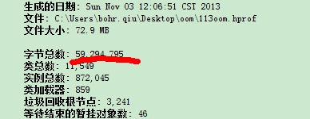
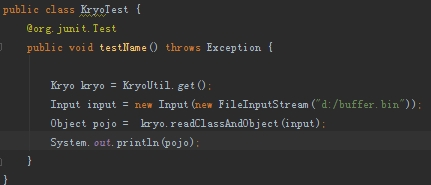
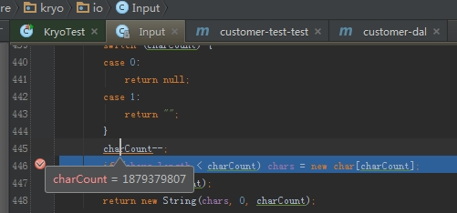

生产环境某系统上线大概4-5个小时后，出现OOM(java.lang.OutOfMemoryError: Java heap space )异常。按照目前的压力来说出现OOM不应该，本次上线也没有对代码进行过多的修改。和相关开发人员沟通后，发现上线之前memcached缓存没有清空，memcached存储着kryo序列化后的二进制数据，涉及到的对象增加了属性，初步怀疑是kryo反序列话时出了问题。

<!--more-->
拿到hprof日志后，分析如下：

初步用jvisualvm看下

占用内存很小，tomcat的heap设置为4096M，不可能是内存泄漏造成的。

 
分析线程dump发现

在kryo反序列化报了oom

用MAT执行OQL:

dump buffer(见附件)到本地反序列化

然后就悲剧了...

要分配的这个char数组太大了，内存根本就不足。kryo序列化不会存储java 字段信息，他会把属性值按照一定的顺序写到byte数组里面的(没有字段信息)。如果反序列化时，java对象结构变化，就有可能出现今天的悲剧事件。