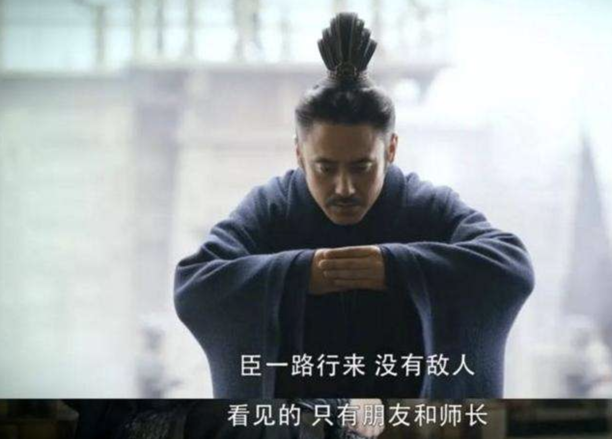
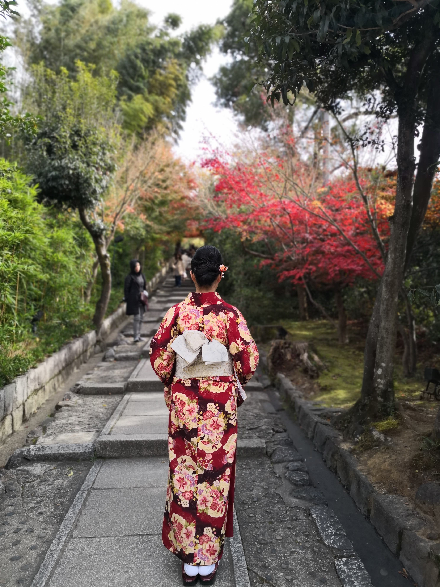
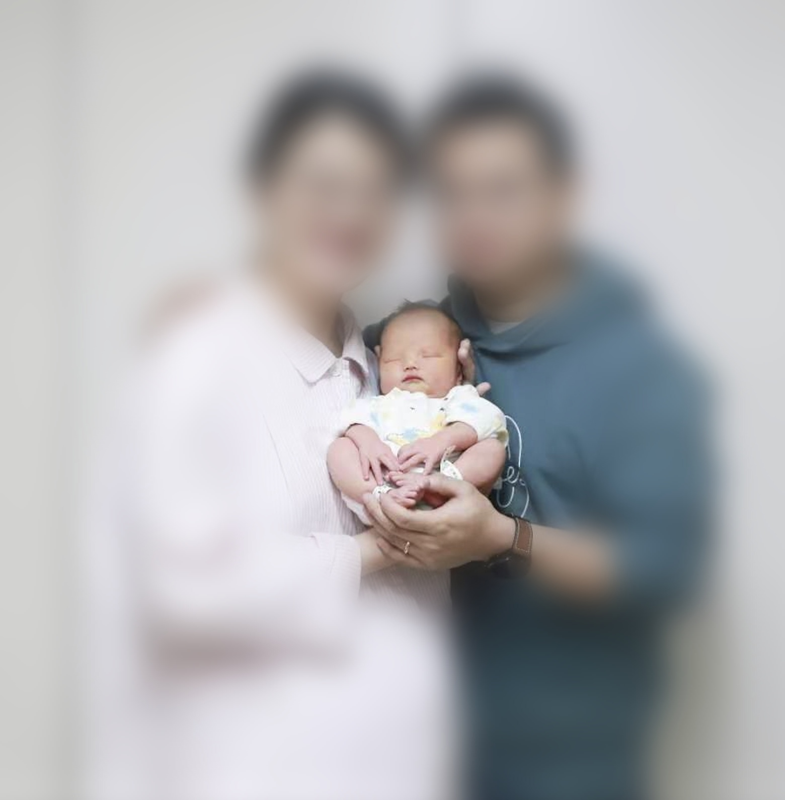
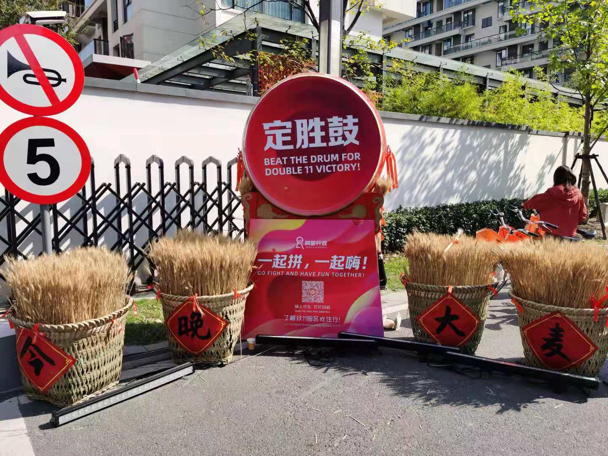
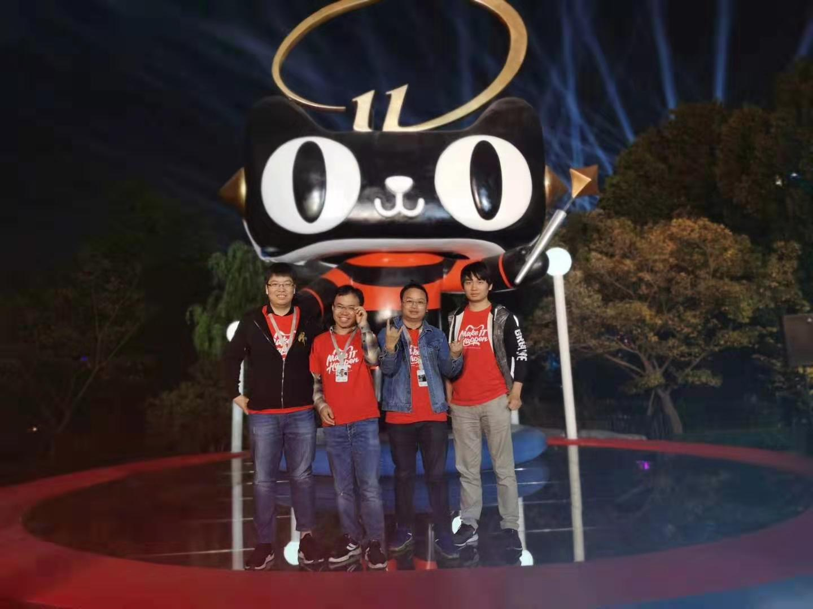

> 年年岁岁花相似，岁岁年年人不同

以往说这句话时，其实大多数还是不变，但是为了显得有进步，每次年终回顾时，总是把这句话搬出来。2019比较特别，人生经历了很重要的变化，总结过去，畅想未来。

# 2019

## 生活

### 离开

16年夏，滴滴某位中间件大神通过github找到我，问我要不要考虑去北京发展，我当时很自傲的回答『我在重庆啥都有了，怎么会选择离开呢』。

16年冬，克星推荐我去华为做serverless，同样也以自己身体需要调理为理由拒绝离开,一直感觉对不起克星，今年和克星聊几次，慢慢释怀了。

没想到经过几年的辛苦折腾，终于把自己弄离开了。现在回过头来，不离开的理由非常幼稚，不想离开是因为没吃够生活的苦，稍微尝到了一点乐趣就忘乎所以，同时眼界还不够，把自己的选择局限在一个非常狭窄的圈子里,不知道真正的乐。

种一棵树最好的时间是十年前，其次是现在，虽然离开得有点晚，但也胜于执迷其中，自我安慰下，心智的成长需要一些磨练，世人皆苦，你不算最苦的。

感谢陪伴的家人和朋友。

### 适应

之前来杭州多次，每次过来只待几天，玩得还是很开心的，每次都恋恋不舍的离开。但真正在杭州生活似乎就不轻松了，吃住行都遇到了挑战。

杭州是一个美食荒漠，没啥好吃的，娜娜我和都想吃辣，刚到杭州时，用小火锅底料抗住了很长一段时间，偶尔去吃吃火锅，弥补下感官刺激。

杭州的房价比较高，不少高价位的盘，周边的配套设施几乎没有，加上我们要首付6层，对于买房的时机一直没有拿定。两次参与万人摇的盘，如娜娜所说，不是咱们运气差，只是证明咱们是普通人。

杭州的公共设施非常差，就一个大工地，常年施工中；刚开始几个月住得非常远，每天7天起床，坚持了半年，实在忍受不了了，就在公司附近租了一个房子，优点是不用早起，缺点是晚上似乎睡得更晚了，娜娜有几次对我说，要不我们还是搬到原来的地方去吧，至少可以早睡😄。

吃住行都受到挑战的时候，多次在知乎上看『离开杭州』相关的话题，看来世人皆苦，你仍然不算最苦的。

难受的过程正是成长的过程。

### 行万里路

认同『读万卷书不如行万里路』，因为读者理解的内容和作者书里表达的内容有偏差，需要读者亲身体验才能真切感受。

日本之行感受特别深，惊叹他们对文化的传承,对人性的关怀。公交车到站停稳后会侧偏向乘客，方便老年人上下车；有次遇到一位坐轮椅的老奶奶在公交车司机的帮助下上公交车，这样的际遇在国内几乎看不到。

南京之行特别仓促，周五去周天回。第一次体验了排队一个多小时吃南京大牌档，虽然这一个小时等的过程特别急躁，但享受美食的过程印象特别深刻，回到杭州后也去了几次南京大牌档，满足感不复存在，不容易得到的才会有深刻的记忆。

两次上海之行，一次是和三娘全家去迪斯尼过跨年，一次是和三妹全家去迪斯尼海洋馆。迪斯尼玩着太累啦，排队花的时间太长，印象中就玩了两个项目；海洋馆的体验还挺好，全程娜娜非常开心。

之前信誓旦旦的说，花两年时间把杭州周边城市都玩个遍，结果现在还没真正开始。

路还没走够，书也还没读够，继续。

### 家庭

某律师朋友的观点『生命的意义在于延续』，我和娜娜的观点是『生命的意义在于体验』，答案没有对与错，酸甜苦辣都是味道，都需要慢慢品尝，可能先苦后甜，也可能先苦后更苦。有个小朋友的体验如何，慢慢品尝。

娜娜怀孕的过程非常艰辛，前三个月反应特别大，吃了就吐，而且特别没精神。刚怀上去检查宝宝还不是很稳，医生让保胎试试，妈妈和三妹都过来照顾，我俩安慰自己，这是上天的选择，如果胚胎质量不好，自然选择淘汰了它。保胎一段时间后去听胎心，心跳扑通扑通~，医生说你们的宝宝非常有活力，娜娜高兴得流眼泪了。

保胎完了面临最大的挑战是睡眠不好，怀孕后晚上会起床几次，醒了后就很难睡着，睡眠不足导致经常头痛，头痛时疼得哭时为了宝宝又不能吃药，没有其他好的招，只能按摩，好几次都不想再让坚持下去。比较神奇的是，到了后期，头痛症状消失了，也许是文曲星下凡，不忍心她妈妈受苦，感谢上天的安排。

孕晚期挺着大肚子上班，同事几次催她赶快休假，12月19号开始休产假，晚上就发动了。送到省妇保急诊，已经开两指，医生让直接送到产房待产，在产房待了一会儿，实在是太疼了，求护士给打了无痛，睡觉醒来开十指，宝宝顺产成功。从19号23点去医院，到20号10点29小朋友出生，在这十个小时里，坐在家属区等待的我，和躺在产床上痛苦的娜娜，之前脑子里演练的场景都不复存在，一直在反思，我的参与感在哪里，我又能做什么，直到听到母女平安的消息，喜极而泣。。。

虽然你只是一个过客，但有你的生命更精彩，Nemo。

## 工作

### 从零开始

之前的职业生涯只做技术，完全不懂业务，也不懂业务背后的商业价值，所以在选择新的工作时，偏向于金融相关的业务。幸运的是遇到了博一老大，经过一下午的面试，面试通过，顺利拿到offer。

入职之前那段时间，在家挺无聊，白天娜娜上班，我就把sofa开源的中间件看了个遍，结果发现sofaboot所做的事情，就是几年前我做的工作，没花多少经历就看完了，幻想着入职后就给sofaboot提不少pull request，踏上人生巅峰。

入职后幻想破灭了，完全听不懂大家在干啥，晨会一脸蒙逼，技术栈也和之前看的不一样，突然发现十年工作经验在这个领域的经验为零，有些恐慌，也很迷茫，蚂蚁对人的要求非常高，既要熟悉你负责的模块，又要负责你熟悉的上下游，还要熟悉中间件，多亏师兄们给了很详细的学习计划，开始学习之旅。

花了将近半年时间，把所接触的系统代码主流程看了一遍，看完后晕晕乎乎的，有些概念不是特别熟悉，特别是会计里面的概念，基本名词的理解都需要花不少的精力。这个过程身心俱疲，非常沮丧，5天看7个系统代码，看完能串出主流程，由于缺少业务需求输入，不知道为什么要这样设计，也不知道看这些代码的意义何在。直到负责第一个大项目，这个项目是网商系统链路最长的项目，在这个项目中把很多细节都串起来了，在业务灰度过程中，核算缺配置，在脑海中第一时间蹦出核算组，精确到代码行的给业务同学分析遗漏所导致的问题。

业务的学习非常有意思，了解了技术带来的商业价值，不过还不够体系，还得继续串。

As Steve Jobs say:You can't connect the dots looking forward; you can only connect them looking backwards.

### 一些活动

百阿认识了一帮来至五湖四海的兄弟，同时也是了解蚂蚁的业务，价值观的机会。关于价值观，我一直很好奇，阿里这么大，是什么支撑了他持续进步，而之前我所在的公司，价值观只是口号，大家把价值观作为言的一部分，管理层很多人都没有遵守，而且还有言行互相矛盾的地方。而阿里的价值观不太一样，首先阿里的价值观具有普世价值，拿着这个价值观去其他公司也可以适用，他要求的是一个正能量满满的人；其次师兄们的言行举止里实践着价值观，且身体力行的传承价值观。阿里很多土话，用土话来传承文化，用制度来维护文化，让新人融入阿里，文化就是言行举止！百阿最后的团队表演是『老子今天不上班』，来自天南海北的兄弟们都用成都话唱，轰动全场。

阿里自己创造的双十一节练人，练系统，练团队，内部有句话叫没有经历双十一的同学不算是真正的蚂蚁人。双十一提前开始全链路压测，应急预案演练，系统优化改造，整体性能超过宇宙第一行，双十一当天如丝般顺滑。唯一的遗憾是今年小组参与的同学太少了，明年带其他新同学去感受。

还有一些活动，包括培训中间件知识的精武门，拿了第一，赢取抱枕一个；程序员节的超级MA力大赛，止于十二名，微贷第一，错失与合伙人进餐的机会。还有其他阿里特有的活动，比如527，1218攻防演练，完善了知识体系也挺有意思，明年继续。

一起拼，一起嗨！

### 团队

和以往带团队不一样，这次带团队挑战比较大，原因有几点：第一这是一个不太熟悉领域的团队😓；第二大家都很优秀，也很专业，还很努力；第三业务挑战巨大巨大，为网商所有业务提供资产交换服务，tps网商第一；第四团队成员大多数是新人。团队经过几个月的磨合，慢慢发展到7个人，这要特别感谢涛哥及时帮助纠偏误区，认识到了需求和资源之间的鸿沟，建立了良性的持续改进氛围。

持续改进是小团队进化的基石，每周都能看到进步的团队很可怕。

## 总结

2019是人生最充实的一年，也是人生最拼搏的一年，也是人生变化最大的一年，继续加油，你是最胖的！

感谢陪伴中的同事，朋友，家人！

# 2020

先立flag，明年年底在来review：

认真生活：

- [ ] 深入学习养娃知识，努力成为此领域专家
- [ ] 读2-3本书
- [ ] 一家人去周边1-2个城市闲逛
- [ ] 每月至少锻炼2次

快乐工作：

- [ ] 摸透本领域
- [ ] 熟悉其他领域
- [ ] 努力努力