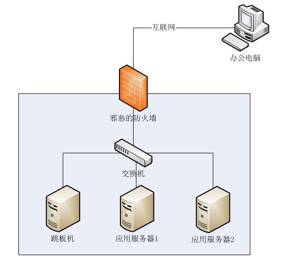
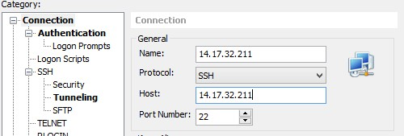
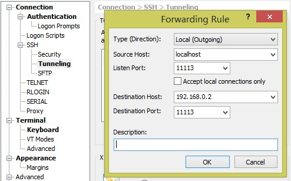
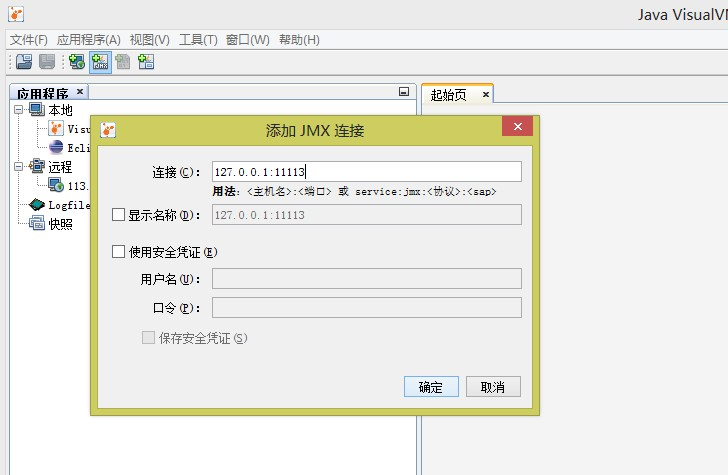

很多时候，我们需要连到远程应用服务器上去观察java进程的运行情况。由于邪恶的防火墙限制我们很难直接连到应用服务器。所以，也有了本文...
<!--more-->
常见的网络拓扑结构如下：

如上图所示，办公电脑通过互联网连接跳板机,在跳板机上，我们可以访问应用服务器，查看应用服务器日志或做其他操作。现在我们需要在办公电脑上监控应用服务器1上的java进程。

## ssh tunneling

由于防火墙的限制，我们不能直接访问应用服务器。我们可以通过ssh tunneling来实现从办公电脑访问到应用服务器服务端口。

- 跳板机：内网ip：192.168.0.1 外网ip：14.17.32.211 ssh端口：22

- 应用服务器1：内网ip：192.168.0.2 应用端口：11113

通过ssh tunneling，我们利用ssh client建立ssh tunneling映射如下：

	127.0.0.1:11113->14.17.32.211:22->192.168.0.2:11113

本地应用客户端通过访问本地11113端口，ssh client会把请求转发到应用服务器192.168.0.2:11113

## JMX

一个典型的jmx url：

service:jmx:rmi://localhost:5000/jndi/rmi://localhost:6000/jmxrmi

这个JMX URL可以分为如下几个部分：

- service:jmx: 这个是JMX URL的标准前缀，所有的JMX URL都必须以该字符串开头。

- rmi: 这个是connector server的传输协议，在这个url中是使用rmi来进行传输的。JSR 160规定了所有connector server都必须至少实现rmi传输，是否还支持其他的传输协议依赖于具体的实现。比如MX4J就支持soap、soap+ssl、hessian、burlap等等传输协议。

- localhost:5000: 这个是connector server的IP和端口，该部分是一个可选项，可以被省略掉。因为我们可以通过后面的服务注册端口，拿到jmx服务运行的端口信息。

- /jndi/rmi://localhost:6000/jmxrmi: 这个是connector server的路径，具体含义取决于前面的传输协议。比如该URL中这串字符串就代表着该connector server的stub是使用jndi api绑定在rmi://localhost:6000/jmxrmi这个地址。可以理解为，localhost:6000提供了服务的注册查询端口，具体的jmx服务实现在localhost:5000

java进程一般通过如下的配置启动jmx：

 	-Dcom.sun.management.jmxremote -Djava.rmi.server.hostname=192.168.0.2  -Dcom.sun.management.jmxremote.port=11113 -Dcom.sun.management.jmxremote.ssl=false -Dcom.sun.management.jmxremote.authenticate=false

通过上面的配置可以看出，只配置了服务注册查询端口11113，而实际的jmx服务运行端口是在运行时通过11113获取到的。

## 如何实现

上面提到了用ssh tunneling来实现端口转发，跳过防火墙的限制，也讲到了jmx的服务暴露方式。同时引出了我们遇到的问题，我们为了监控远程服务器上的java进程，我们能通过本地的11113端口访问到远程服务器上的JMX服务注册查询端口11113，但是JMX服务运行端口，我们不知道(因为是在运行时随机指定的)，这样貌似走进了死胡同。

幸运的是我们自己来初始化JMXConnectorServer时，我们可以指定具体的jmx服务端口，并且还可以指定JMX服务端口和JMX注册查询端口为同一个端口。比如我们可以设置JMX url为：

	service:jmx:rmi://localhost:11113/jndi/rmi://localhost:11113/jmxrmi

### 解决方案如下：

1. 通过Java Agent实现在java业务代码运行之前，启动jmx server，并且设置jxm服务注册查询端口和服务端口为同一端口，JMX URL为：

		service:jmx:rmi://127.0.0.1:11113/jndi/rmi://127.0.0.1:11113/jmxrmi
	
	

2. 通过ssh tunneling实现端口转发，我们的JMX client只需要访问本地的端口就能跳过防火墙的限制

注意：这里ip地址写为127.0.0.1是有原因的，看看我们的请求流程:

- JMX client访问本地的127.0.0.1:11113
- 注册查询请求被ssh tunneling转发到应用服务192.168.0.2:11113
- 应用服务器上的java进程JMX注册查询服务会告诉JMX client,JMX服务在127.0.0.1:11113
- 然后JMX client再访问127.0.0.1:11113
- 服务请求又被ssh tunneling转发到应用服务192.168.0.2:11113，这次建立了JMX服务请求连接

### 操作步骤

1. 下载[jmx agent](https://github.com/bohrqiu/jmx_agent.git)后执行`mvn package`，在target目录会生成jmxagent-0.0.1.jar，上传此jar包到服务器
2. 配置java服务进程启动参数
	
		-javaagent:/root/jmxagent-0.0.1.jar -Djmx.rmi.agent.hostname=127.0.0.1 -Djmx.rmi.agent.port=11113
	
	上面设置jmx服务ip为127.0.0.1，服务端口为11113，使用javaagent jar包路径为/root/jmxagent-0.0.1.jar

3. 启动java服务
	
	在控制台中，可以看到`Start the RMI connector server`的字样，说明服务正常启动了。

4. 建立ssh tunneling

	在xshell中配置ssh tunneling很简单，只需要两个步骤：

	配置连接，我们这里需要连接到跳板机的ssh服务，如下图：	

	
	
	配置tunneling，配置稳定端口11113，应用服务器192.168.0.2:11113

	

5. 使用jmx client监控远程服务

	在jvisualvm中添加JMX连接，如下图：
	
	

6. enjoy!	

PS:附带一个maven启用此解决方案的脚本

	export MAVEN_OPTS="-server -Xms8192m -Xmx8192m -XX:PermSize=128m -XX:MaxPermSize=256m -XX:+PrintGCTimeStamps -XX:+PrintGCDetails  -XX:SurvivorRatio=4 -XX:+UseConcMarkSweepGC -XX:+UseParNewGC -XX:MaxTenuringThreshold=5 -XX:+CMSClassUnloadingEnabled -verbosegc  -Xloggc:/var/log/xxx/gc.log -XX:+HeapDumpOnOutOfMemoryError -XX:HeapDumpPath=/var/log/xxx/oom.hprof  -Djava.awt.headless=true  -javaagent:/root/jmxagent-0.0.1.jar -Djmx.rmi.agent.hostname=127.0.0.1 -Djmx.rmi.agent.port=11113"
	mvn exec:java -Dexec.mainClass="com.xxx.Bootstrap" &