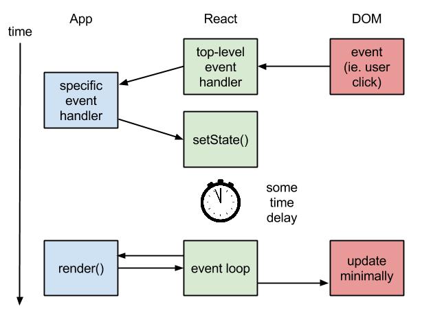

昨天给朋友推荐了`React`，但心里还真没有底，这里整理下资料，如果不考虑浏览器兼容性的问题，这东东真不错😄。

#### 1. 虚拟dom是什么？

虚拟DOM是HTML DOM的抽象，它和浏览器的实现分离。

#### 2. 为什么虚拟dom快？

DOM拖慢JavaScript。所有的DOM操作都是同步的，会堵塞浏览器。JavaScript操作DOM时，必须等前一个操作结束，才能执行后一个操作。只要一个操作有卡顿，整个网页就会短暂失去响应。浏览器重绘网页的频率是60FPS（即16毫秒/帧），JavaScript做不到在16毫秒内完成DOM操作，因此产生了跳帧。虚拟dom的改变并不会引起浏览器dom的改变，而是由React在合适的时机比较差异并渲染，保证`FPS`。

#### 3. Why is React's concept of Virtual DOM said to be more performant than dirty model checking?

React knows when to re-render the scene because it is able to **observe when this data changes**. Dirty checking is slower than observables because you must poll the data at a regular interval and check all of the values in the data structure recursively. By comparison, setting a value on the state will signal to a listener that some state has changed, so React can simply listen for change events on the state and queue up re-rendering.(这点随着es6的`Proxy`到来，`AngularJS`会越来越强大😄)

#### 4. What makes React fast ?

* Batched DOM read/write operations.
* Efficient update of sub-tree only.

Compared to dirty-check, the key differences IMO are:

Model dirty-checking: React component is explicitly set as dirty whenever setState is called, so there's no comparison (of the data) needed here. For dirty-checking, the comparison (of the models) always happen each digest loop.

DOM updating: DOM operations are very expensive because modifying the DOM will also apply and calculate CSS styles, layouts. The saved time from unnecessary DOM modification can be longer than the time spent diffing the virtual DOM.

#### 4. What's the problem of template engine？

Template languages express the initial render of your application, and you’re responsible for manually mutating the state of the UI when your backing data changes and events occur.

#### 5. how to run ?

上面部分是用户触发的，下面部分是定时触发的。

首先说上面部分：

1. 用户点击某dom
2. `top-level event handler`分发事件到指定的`event handler`

	`top-level event handler`指的是`document`上的`event handler`,这种方式能够提高性能(因为在每个真实的dom上面绑定事件是非常慢的)并且跨浏览器(浏览器中的事件本身就没有统一)

3. 用户代码调用setState()

	`AngularJS`双向绑定，不需要用户调用状态变更。所以，必须要去做大量的`dirty check`。虽然是一种倒退，但是为了性能忍了，等ES6吧。

下面部分的逻辑：`event loop`周期性的检查有状态组件是否`dirty`，然后通过`diff`算法批量更新浏览器dom树。
