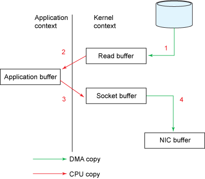

本文讲了如何用`zero copy`技术来提高I/O性能.

静态文件服务器需要把磁盘上的数据发送给客户端.这里cpu消耗比较少,但是效率不高:内核从磁盘读数据,内核/用户空间交换数据,最后写到socket.数据在内核/用户空间转换时,需要拷贝数据,消耗cpu和内存带宽.对于java应用来说,还需要合理的使用缓冲区来减少gc的压力.

java提供了`transferTo`方法来使用`zero copy`技术.他可以让数据直接从一个`channel`到另外一个`channel`.避免上面说到的一些问题.

### 1.传统的解决办法

过程类似于下面的代码:

	File.read(fileDesc, buf, len);
	Socket.send(socket, buf, len);
	
#### 1.1数据拷贝
	

这种方式会有四次内存拷贝

#### 1.2 上下文切换

这种方式会有四次上下文切换.

#### 1.3 过程说明

1. `read`方法导致一次从`user mode`到`kernel mode`的上下文切换.系统调用`sys_read`从文件读取数据,通过DMA,把磁盘上的数据读到`kernel address space buffer`.
2. 数据从`kernel address space buffer`拷贝到`user buffer`.`read`返回,导致从`kernel mode`到`user mode`的上下文切换.现在数据被读到了`user address space buffer`.
3. `send`方法导致一次`user mode`到`kernel mode`的上下文切换.第三次拷贝把拷贝到`kernel address space buffer`.此buffer关联着`destination socket`
4. 系统`send`调用返回时导致第四次上下文切换,DMA把`kernel address space buffer`中的数据发送到协议引擎导致第四次数据拷贝.

#### 1.4 intermediate kernel buffer

使用`intermediate kernel buffer`主要为了提高性能,读的时候扮演缓存的角色,写的时候可以让应用程序实现异步(应用程序写到kernel buffer就返回).不幸的是,当我们处理的数据大于内核缓冲大小时,这样的拷贝是完全没有任何意义的.

### 2.零拷贝的方式

使用如下的代码来完成零拷贝

java方法:

	public void transferTo(long position, long count, WritableByteChannel target);
	
系统调用:

	#include <sys/socket.h>
	ssize_t sendfile(int out_fd, int in_fd, off_t *offset, size_t count);

#### 2.1 数据拷贝

涉及到3次数据拷贝.

#### 2.2 上下文切换

涉及到2次上下文切换

#### 2.3 过程说明

1. `transferTo`方法让DMA把磁盘文件读到`kernel read buffer`.然后内核把`kernel read buffer`中的数据拷贝到`socket buffer`.
2. `DMA`把`socket buffer`中的数据拷贝到协议引擎.

### 3 更好的方式

通过上面使用这种方式,上下文切换从4次变为了2次.数据拷贝减少了一次.如果网卡支持`gather operations`,linux 2.4内核就开始提供更好的解决方案.

1. `transferTo`方法让`DMA engine`把磁盘文件内容拷贝到内核缓冲区.
2. 数据不需要拷贝到`socket buffer`.`socket buffer`里只需写入数据的地址和长度.`DMA engine`从内核缓冲区把数据读到协议引擎.

通过内核带来的特性,数据拷贝变为了2次(这两次拷贝都是DMA在做).cpu copy变为了0.

### 4 写在最后

文章地址`http://www.ibm.com/developerworks/library/j-zerocopy/`,里面有性能测试结果.后面附带有性能测试程序.不过这个测试程序不太恰当,应该都用nio的api来测试`tansferTo`和非`tansferTo`.

静态文件服务器一般都有静态资源缓存(apache可以配置,其他的服务器不了解).如果使用内存缓存,减少了读的过程.内存拷贝变为cpu copy `application buffer` -> `socket buffer`,DMA copy `socket buffer` ->`NIC buffer`,磁盘io大大降低了.

`NIO`不是很熟悉,不知道通过`ByteBuffer.allocateDirect()`+`transferTo`+`gather operations`能不能让copy变为一次.

